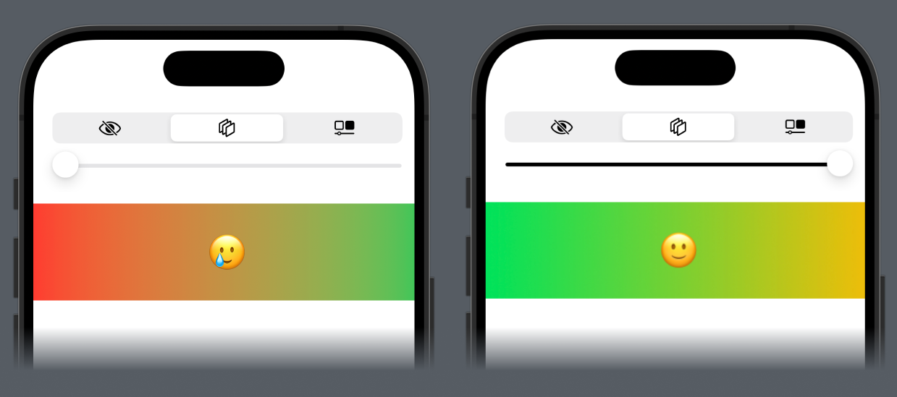

# FigmaPreview

<p align="center"/>
  
</p>

FigmaPreview is a Swift library designed to streamline the integration of Figma designs into your iOS applications. It allows developers to preview UI components directly from Figma files, facilitating a smoother design-to-code transition and ensuring that your app's UI matches the design specifications with precision.

## Features

- **Direct Preview:** Instantly preview Figma designs in your Swift projects.
- **Easy Integration:** Seamlessly integrates with Xcode, leveraging Swift Package Manager for straightforward installation.
- **Design Sync:** Keep your application's UI in sync with the latest design changes in Figma.

## Installation

### Swift Package Manager

You can add FigmaPreview to an Xcode project by adding it as a package dependency.

1. From the File menu, select Swift Packages > Add Package Dependency...
2. Enter the package repository URL: `https://github.com/artemnovichkov/FigmaPreview.git`
3. Specify the version rules that make sense for your project.

## Usage

### Importing the Library

First, import FigmaPreview into your Swift file:

```swift
import FigmaPreview
```

### Example Usage

Here's a simple example to demonstrate how you might use FigmaPreview to load a design component from Figma:

```swift
#Preview {
    ContentView()
        // Direct link to your Figma component, or
        .compare(with: URL(string: "https://www.figma.com/file/<file-id>/Untitled?node-id=<component-id>")!)
        // File ID and Ccmponent ID of your Figma components, or
        .compare(with: "<file-id>", componentID: "<component-id>")
        // Exported local image, for example, from Preview Assets
        .compare(with: Image(.component))
        .environment(\.figmaAccessToken, "figma-access-token")
}
```

If you're using Figma links, don't forget to generate a Figma Access Token in Figma > Help and account > Account settings

<p align="center"/>
  
</p>

## Contributing

I welcome contributions! If you would like to help improve FigmaPreview, please submit a pull request or open an issue for discussion.

## Author

Artem Novichkov, mail@artemnovichkov.com

## License

The project is available under the MIT license. See the [LICENSE](./LICENSE) file for more info.
